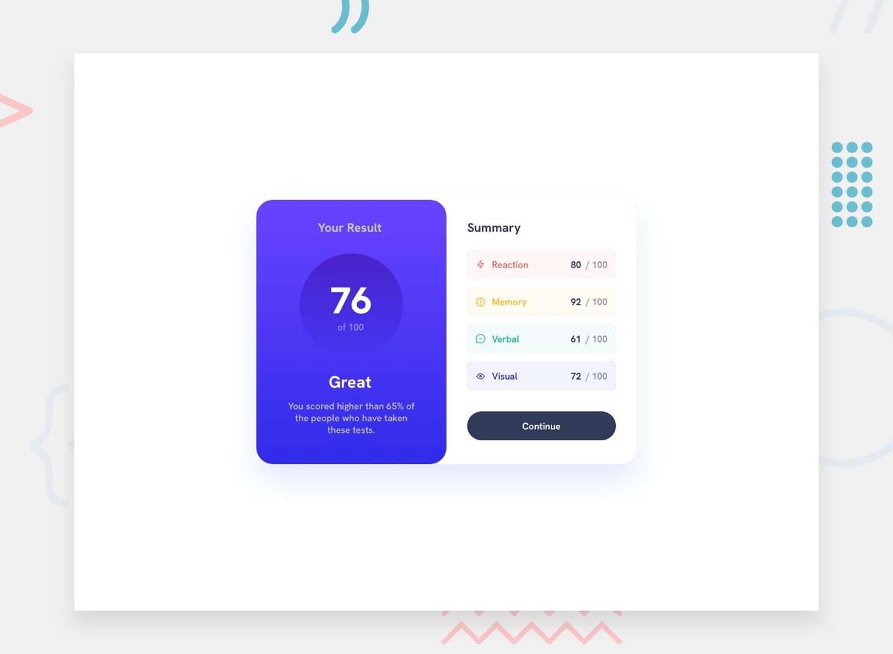

# Frontend Mentor - Results Summary Component

Esta é a minha solução para o desafio **Results Summary Component** do Frontend Mentor.

## 🚀 O Projeto

O objetivo deste desafio foi construir um componente de resumo de resultados focado na construção de páginas semânticas com a utilização das tags do HTML5 e em boas práticas de arquitetura CSS, explorando o uso de gradientes e layouts responsivos complexos.

### 📸 Preview do Resultado

  

## 🧠 O que eu aprendi
Neste projeto, aprofundei meus conhecimentos na criação de gradientes lineares e circulares complexos para o fundo do componente. Pratiquei a organização de classes CSS específicas para gerenciar cores de fundo e de texto diferentes para cada item da lista de sumário, mantendo o código limpo e escalável. Também foquei na responsividade, garantindo que o card se adapte perfeitamente de layouts horizontais (desktop) para verticais (mobile).

## 🛠️ Tecnologias Utilizadas:
- HTML5
- CSS3