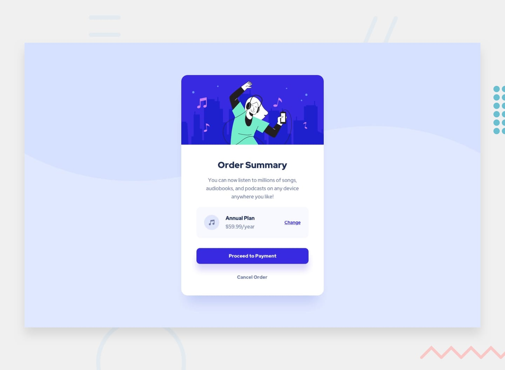

# Frontend Mentor - Order Summary Card

Esta é a minha solução para o desafio **Order Summary Card** do Frontend Mentor.

## 🚀 O Projeto

O objetivo deste desafio foi construir um card de resumo de pedido focado na aplicação da metodologia **BEM (Block, Element, Modifier)** para a nomenclatura de classes e na utilização de **CSS Nesting** nativo para uma folha de estilo mais organizada e moderna.

### 📸 Preview do Resultado

  

## 🧠 O que eu aprendi

Neste projeto, foquei em resolver a dificuldade de nomeação de classes através da metodologia BEM, garantindo que cada componente tivesse uma estrutura semântica e escalável. Aprofundei meus conhecimentos em **CSS Nesting** para agrupar estilos de forma lógica.

## 🛠️ Tecnologias Utilizadas:

- HTML5
- CSS3 (BEM & Nesting)
